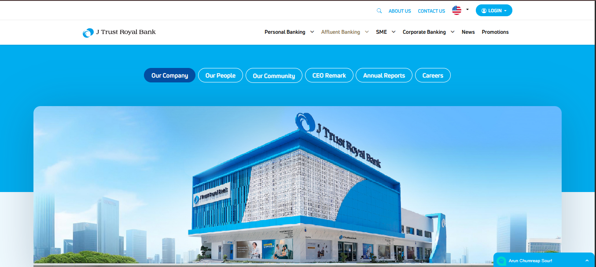
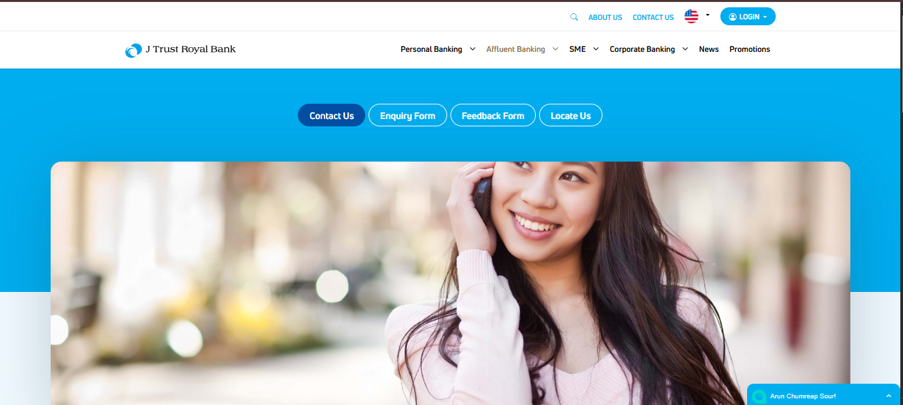

# J Trust Royal Bank


---
# Screenshot 

## Homepage


## Contact page

# Function
## Home
#### The homepage with a focus on the bank's services, including Personal Banking, Affluent Banking, SME & Corporate Banking, News, and Promotions. It features a prominent image of a bank branch building with the bank's logo and name, along with navigation options like Our Company, Our People, Our Community, CEO Remark, Annual Reports, and Careers.
---
## Contact
#### shows a different section, likely related to customer support or contact, with options such as Contact Us, Enquiry Form, Feedback Form, and Locate Us. It includes a promotional image of a person using a phone, suggesting customer service or mobile banking features.
# Drawback
- The J Trust Royal Mobile app has reported problems such as small, unresponsive text and layout issues, indicating a need for improved user interface design.
- Risks like credit/debit card fraud are highlighted, and the app's incompatibility with rooted or jailbroken devices, along with its exclusion of corporate accounts, may limit accessibility for some users.
# HOW TO RUN THIS PROJECT
- Install Python(3.7.6) (Dont Forget to Tick Add to Path while installing Python)
- Open Terminal and Execute Following Commands :

`python -m pip install -r requirements.txt`
- Download This Project Zip Folder and Extract it
- Move to project folder in Terminal. Then run following Commands:
```
py manage.py makemigrations
py manage.py migrate
py manage.py runserver
```
- Now enter following URL in Your Browser Installed On Your Pc
```
http://127.0.0.1:8000/
```
# CHANGES REQUIRED FOR CONTACT US PAGE
- In settins.py file, You have to give your email and password
```
EMAIL_HOST_USER = 'youremail@gmail.com'
EMAIL_HOST_PASSWORD = 'your email password'
EMAIL_RECEIVING_USER = 'youremail@gmail.com'
```
- Login to gmail through host email id in your browser and open following link and turn it ON
```
https://myaccount.google.com/lesssecureapps
```
## Disclaimer
This project is developed for demo purpose and it's not supposed to be used in real application.
## Feedback
Any suggestion and feedback is welcome. You can message me on facebook
### Link
- [Contact on Facebook](https://www.facebook.com/photo/?fbid=2455170501311728&set=a.102093653286103)
- [Subscribe my Channel LazyCoder On Youtube](https://www.youtube.com/)